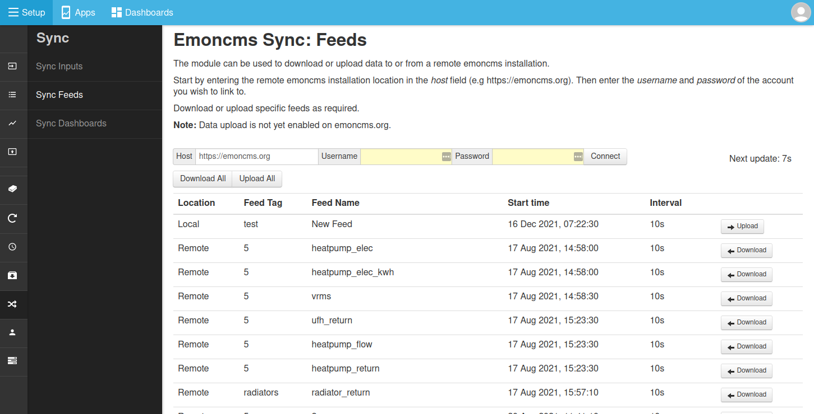

# Sync module for emoncms

Download and upload feed between a local and remote emoncms server

### Automatic EmonPi, Emonbase Update

The Sync module is included in the default EmonPi/EmonBase software stack as of 26th April 2018. If you do not see the sync module under the emoncms Setup tab try running EmonPi or EmonBase update from the Administration page on your EmonPi/EmonBase.

### Manual Linux Installation

**Note:** The sync module has hard coded paths for the emoncms directory location that point to: /var/www/emoncms. If your installation has emoncms installed in /var/www/html/emoncms you will need a symlink to /var/www/emoncms:

    ln -s /var/www/html/emoncms /var/www/emoncms
    
The setting **$homedir** in emoncms settings.php also need to be set to reflect your system.    

Install the sync module into home folder (e.g. /home/pi) directory (rather than emoncms/Modules):

    cd ~/
    git clone https://github.com/emoncms/sync.git

Symlink the web part of the sync module into emoncms/Modules, if not using Raspberry Pi replace 'pi' with your home folder name:

    ln -s /home/pi/sync/sync-module /var/www/emoncms/Modules/sync
    
### Install Service Runner

The sync module downloads or uploads data using a script that runs in the background. This script can be automatically called using the emonpi service runner. The emonpi service runner can be installed on any linux machine. The installation steps are:

Install the emonpi repository into home folder (e.g. /home/pi):

    cd ~/
    git clone https://github.com/openenergymonitor/emonpi.git
 
Add the service runner to crontab (enter your home directory username e.g pi):

    crontab -e
    * * * * * /home/username/emonpi/service-runner >> /var/log/service-runner.log 2>&1
    
Ensure service-runner script can run sudo commands:

    sudo nano /etc/sudoers
    
Add line with your username: 

    myuser ALL=(ALL) NOPASSWD: ALL

### Troubleshooting

- Check that the $homedir setting is set appropriately on your emoncms installation
- If your emoncms installation is in /var/www/html/emoncms, make a symlink to /var/www/emoncms as described above.

To run the sync process manually:

    cd ~/
    cd sync
    sudo php sync_run.php
